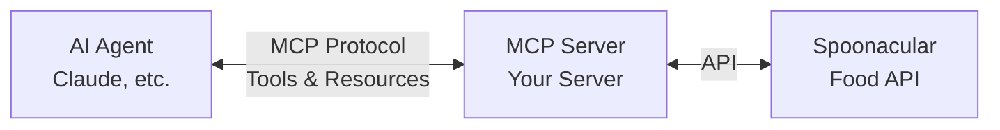

# Building and Deploying an MCP Server on Union

[](https://codespaces.new/unionai/workshops?quickstart=1&folder=tutorials/mcp)

This tutorial shows you how to build and deploy a **Model Context Protocol (MCP)** server on Union that helps AI agents find recipes! You'll create a recipe assistant that can search by ingredients, dietary needs, and more using the [Spoonacular Food API](https://spoonacular.com/food-api).

**What you'll learn:**
- How MCP servers work and their role in AI agent architectures
- Building MCP tools with Python using the official MCP Python SDK
- Deploying your MCP server on Union
- Connecting the server to AI agents in Cursor or other MCP clients

## What is MCP?

The [Model Context Protocol](https://modelcontextprotocol.io/) (MCP) is an open standard that enables AI assistants to securely connect with external data sources and tools. Think of it as a universal adapter that lets AI agents interact with APIs, databases, and services.



### When you need MCP

- As an AI engineer, you want to connect to an external service through a pre-built, standardized, AI-friendly interface.
- As an AI engineer, you need to connect your Skills to actual external services in a compact way.
- As a service provider, you want to expose your services to AI agents in a standardized way.

### When you don't need MCP

- As an AI engineer, you have a self-contained AI system that makes tool calls defined as functions that you fully control.
- As an AI engineer, all of the context and skills access local resources (files, directories, embedded databases, etc).
- As a service provider, you want to expose your services as traditional APIs (REST, gRPC, etc), or the functionality you provide can be delivered via context/Skills that users can download locally.

## Prerequisites

- Python 3.11+
- A Spoonacular API key (free tier available)
- A Union account (sign up at [union.ai](https://union.ai)). If you're here for a workshop, head over [here](https://tryv2.hosted.unionai.cloud/) and sign in.
- `uv` package manager (recommended): installation link [here](https://docs.astral.sh/uv/getting-started/installation/#standalone-installer)

## Setup

### 1. Get Your Spoonacular API Key (2 minutes)

1. Go to [spoonacular.com/food-api](https://spoonacular.com/food-api)
2. Click **Start Now** and create a free account
3. Copy your API key from the dashboard

The free tier includes **150 points/day** - plenty for development and testing!

### 2. Local Environment Setup

```bash
# Clone the repository
git clone https://github.com/unionai/workshops
cd workshops/tutorials/mcp

# Create virtual environment
uv venv .venv --python 3.11

# Activate the venv
source .venv/bin/activate  # macOS/Linux
# or
.venv\Scripts\activate     # Windows

# Install dependencies
uv pip install -r requirements.txt

# If you're in google colab or github codespaces:
uv pip install keyrings.alt
```

Next, install Claude Code: https://code.claude.com/docs/en/setup#installation

Then run `claude` and go through the setup process to use it with
- [An API key](https://platform.claude.com/settings/keys)
- A [Claude subscription](https://claude.com/pricing).

### 3. Environment Variables

Create a `.env` file in this folder:

```bash
SPOONACULAR_API_KEY=your-api-key-here
```

## Project Structure

```
tutorials/mcp/
├── README.md                           # This file
├── requirements.txt                    # Python dependencies
├── server.py                           # MCP server implementation
├── tools/                              # Spoonacular API tools
│   ├── __init__.py
│   └── recipes.py                      # Recipe API wrapper
└── app.py                              # Union app deployment script
```

## Available Tools

The Recipe MCP server provides these tools for AI agents:

| Tool | Description |
|------|-------------|
| `search_recipes` | Search recipes by name, cuisine, diet, and more |
| `search_by_ingredients` | Find recipes using ingredients you have |
| `search_by_nutrients` | Find recipes by nutritional requirements |
| `get_recipe_info` | Get detailed recipe information |
| `get_similar_recipes` | Find recipes similar to one you like |
| `autocomplete_recipe` | Get recipe name suggestions |

## Quick Start

### Run the MCP Server Locally

```bash
# Test the server locally
python server.py
```

Add to Claude code:

```bash
claude mcp add --transport http spoonacular-mcp http://localhost:8000/mcp
```

> [!NOTE] Alternatively, test the server with the MCP inspector (local only):
>
> ```bash
> npx -y @modelcontextprotocol/inspector
> ```
>
> In the inspector UI, connect to the server at http://localhost:8000/mcp


### Example Usage

Once connected to an AI agent, you can ask things like:

- *"What can I make with chicken, rice, and broccoli?"*
- *"Find me a vegan pasta recipe under 500 calories"*
- *"I want something similar to beef stroganoff"*
- *"Show me high-protein breakfast ideas"*
- *"What's a good gluten-free dessert?"*

Once you're done testing locally, remove this MCP server from Claude:

```bash
claude mcp remove spoonacular-mcp
```

## Deploying to Union

### 1. Connect to Union

```bash
export FLYTE_PROJECT=<project>
```

```bash
# Configure Union CLI
flyte create config \
    --endpoint tryv2.hosted.unionai.cloud \
    --auth-type headless \
    --builder remote \
    --domain development \
    --project $FLYTE_PROJECT
```

>[!NOTE] Optional: Store your API key as a secret
>
> ```bash
> flyte create secret SPOONACULAR_API_KEY
> ```
>
> This will prompt you to copy-paste your Spoonacular API key.

### 2. Deploy the MCP Server

Set a name for your app

```bash
export APP_NAME=<my-app-name>
```

```bash
# Build the container image
python app.py
```

### 3. Configure Your MCP Client

Add the deployed server to your MCP client (e.g., Cursor, Claude Code):

**For Claude Code**:

```
claude mcp add --transport http spoonacular-mcp <app_url>/spoonacular/mcp
```

Where `<app_url>` looks something like this: `https://<subdomain>.tryv2.hosted.unionai.cloud`

**For Cursor** (`~/.cursor/mcp.json`):

```json
{
  "mcpServers": {
    "recipe-assistant": {
      "url": "https://<subdomain>.apps.tryv2.hosted.unionai.cloud/spoonacular/mcp"
    }
  }
}
```

Test it by asking: "What can I make with chicken and rice?"

### 4. Securing the MCP Server

Great! You've

To secure the MCP server, you can use the `REQUIRES_AUTH` environment variable,
which is used by the `app.py` file.

Redeploy the app:

```bash
REQUIRES_AUTH=true python app.py
```

Now you should see that the connections are failing. You'll need to re-configure
the MCP connection with a Flyte API key.

To create a Flyte API key, run the following command:

```
flyte create api-key --name <api-key-name>
```

The output will contain an export command like:

```
export FLYTE_API_KEY="<FLYTE_API_KEY>"
```

⚠️ Save the `"<FLYTE_API_KEY>"` string somewhere safe.

Now re-configure the MCP connection with the Flyte API key:

**For Claude Code**:

```bash
claude mcp remove spoonacular-mcp
claude mcp add --transport http spoonacular-mcp <app_url>/spoonacular/mcp --header "Authorization: Bearer <FLYTE_API_KEY>"
```

Where `<app_url>` looks something like this: `https://<subdomain>.tryv2.hosted.unionai.cloud`

**For Cursor** (`~/.cursor/mcp.json`):

```json
{
  "mcpServers": {
    "recipe-assistant": {
      "url": "https://<subdomain>.apps.tryv2.hosted.unionai.cloud/spoonacular/mcp",
      "headers": {
        "Authorization": "Bearer <FLYTE_API_KEY>"
      }
    }
  }
}
```

Now you should be able to securely connect to the MCP server!

Note: to rotate the Flyte API key, you can run the following commands

```bash
flyte delete api-key <api-key-name>
flyte create api-key --name <api-key-name>
```

## How It Works

### MCP Server Architecture

```python
from mcp.server.fastmcp import FastMCP

# Initialize the MCP server
mcp = FastMCP("Recipe Assistant")

# Define a tool
@mcp.tool()
async def search_by_ingredients(ingredients: list[str], number: int = 5) -> list[dict]:
    """Find recipes using ingredients you have on hand."""
    # Call Spoonacular API
    ...
```

### Spoonacular API Integration

The server wraps these [Spoonacular endpoints](https://spoonacular.com/food-api/docs):

- **Complex Search**: Full-featured recipe search with filters
- **Search by Ingredients**: "What's in my fridge" functionality  
- **Search by Nutrients**: Find recipes by nutritional goals
- **Recipe Information**: Detailed recipe data with instructions
- **Similar Recipes**: Recommendation engine
- **Autocomplete**: Help users find recipe names

## Resources

- [Model Context Protocol Specification](https://modelcontextprotocol.io/)
- [Union MCP Reference Implementation](https://github.com/unionai-oss/union-mcp)
- [Spoonacular API Documentation](https://spoonacular.com/food-api/docs)
- [MCP Python SDK](https://github.com/modelcontextprotocol/python-sdk)

## Troubleshooting

### "402 Payment Required" errors
- You've exceeded your daily API quota (150 points on free tier)
- Wait until midnight UTC for quota reset, or upgrade your plan

### "401 Unauthorized" errors
- Check that your API key is correct in `.env`
- Ensure the environment variable is being loaded

### Connection issues
- Verify your internet connection
- Check Spoonacular API status

## Next Steps

- Add more tools (meal planning, wine pairing, nutrition analysis)
- Build a recipe recommendation workflow
- Integrate with shopping list APIs
- Create a meal prep planning agent
